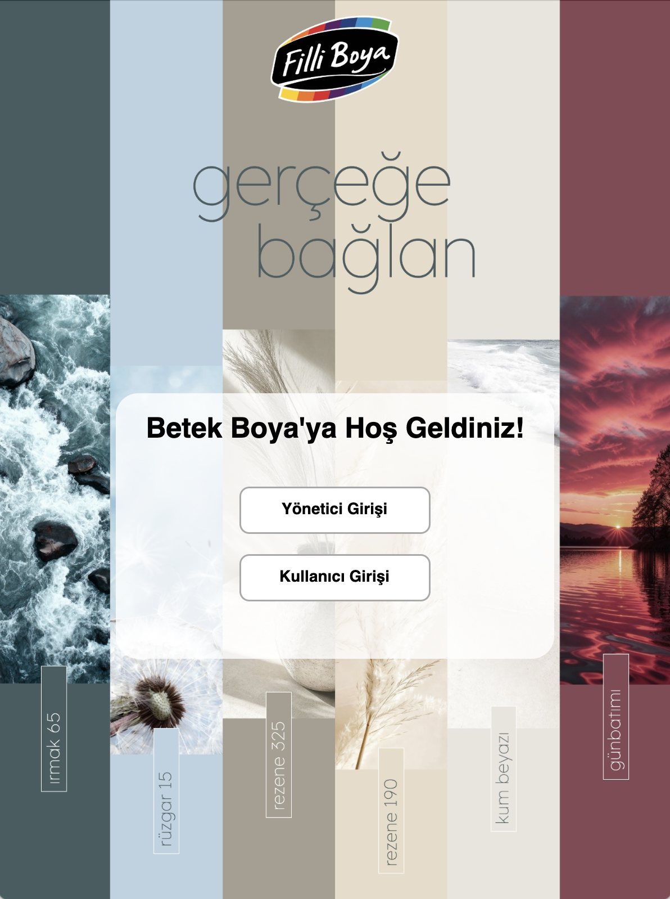
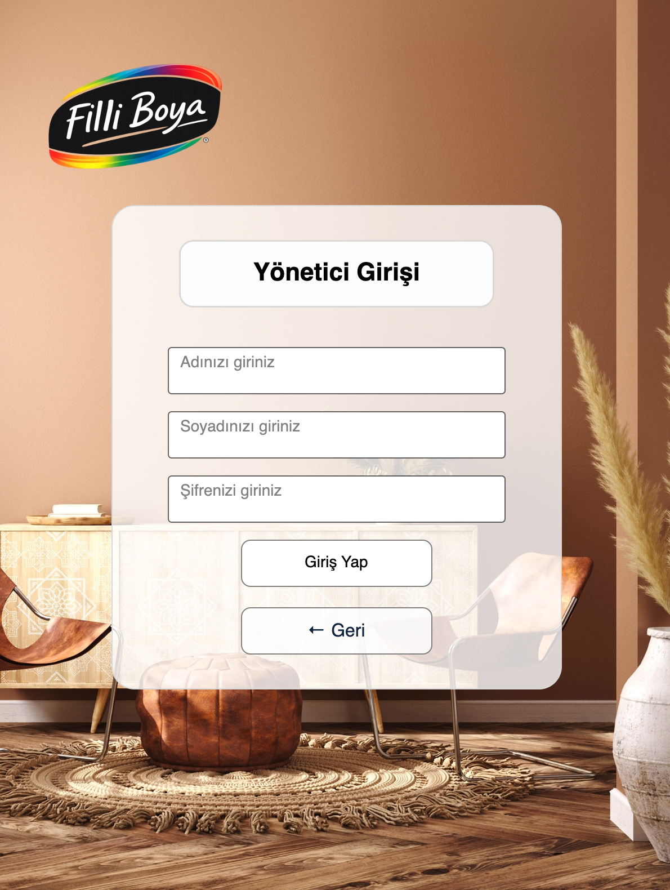
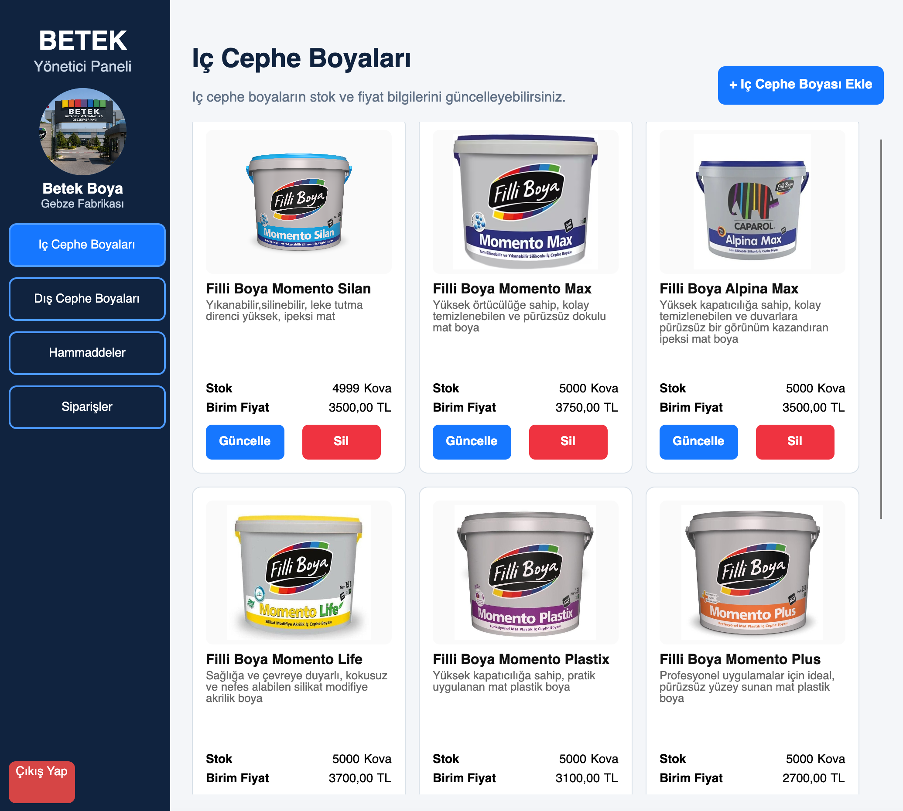
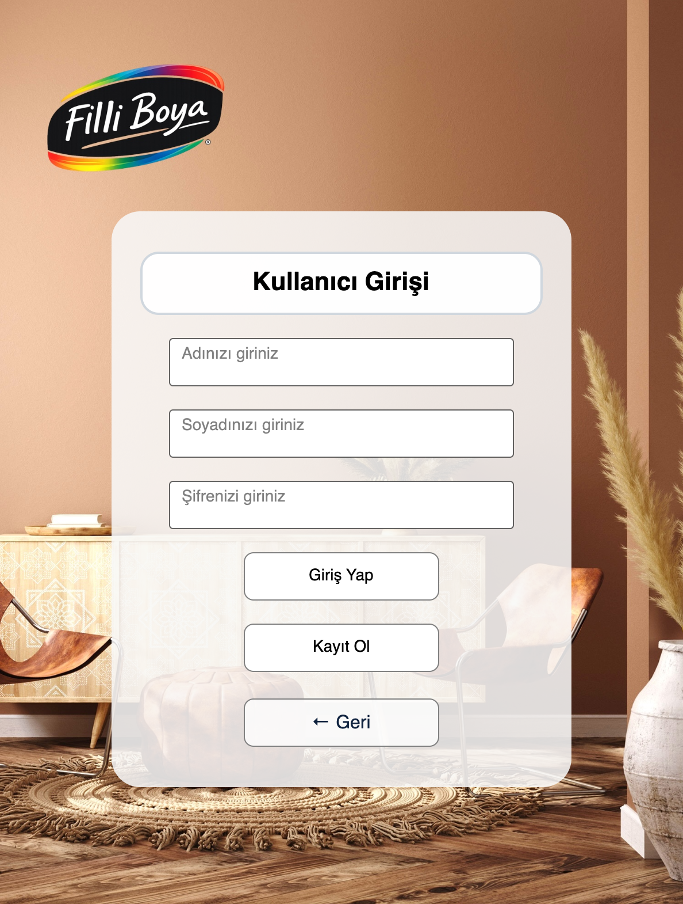
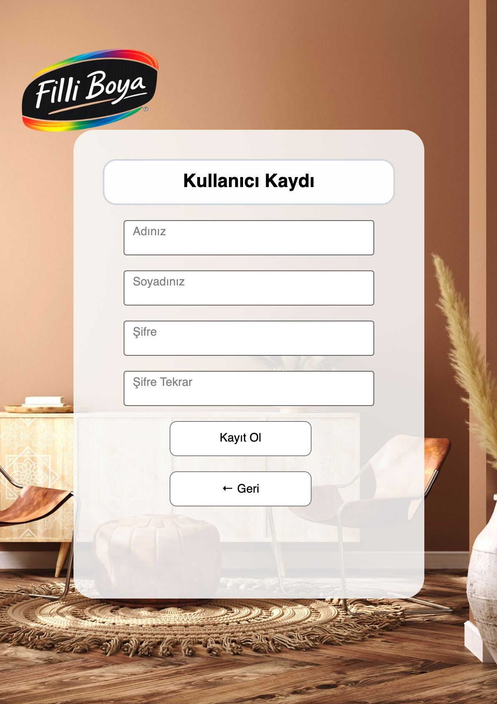
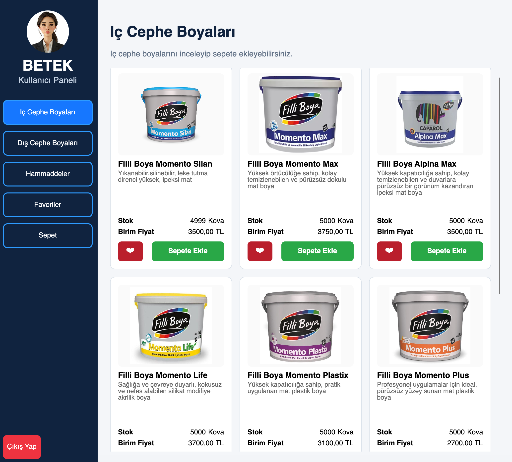

## 📌 Proje Hakkında

Bu uygulama, yöneticilerin boya ürünlerini ve stok bilgilerini kullanıcı dostu bir arayüz üzerinden yönetebilmesini sağlamaktadır. Projeyi geliştirirken masaüstü uygulama geliştirme, veritabanı yönetimi ve kullanıcı arayüzü tasarımı konularında deneyim kazandım.

 ✨ Özellikler

- Yönetici ve kullanıcı giriş sistemi
- İç cephe ve dış cephe boya yönetimi
- Boya ürünlerini ekleme, güncelleme ve silme
- Stok yönetimi
- SQLite veritabanı entegrasyonu
- Avalonia UI ile geliştirilmiş modern masaüstü arayüzü

## 🛠️ Kullanılan Teknolojiler

- C#
- .NET
- Avalonia UI
- SQLite
- Git & GitHub

 ## 📸 Uygulama Görselleri

### ANA MENÜ

### YÖNETİCİ GİRİŞİ

### YÖNETİCİ PANELİ

### KULLANICI GİRİŞİ

### KULLANICI KAYIT OL

### KULLANICI PANELİ

## 🎯 Bu Projede Neler Öğrendim?

- C# ile masaüstü uygulama geliştirmeyi
- Avalonia UI kullanarak kullanıcı arayüzü tasarlamayı
- SQLite ile veritabanı işlemleri yapmayı

## 👩‍💻 Geliştirici

**Zeynep Zorba**

Üsküdar Üniversitesi Yazılım Mühendisliği Öğrencisi
.
.
.
.
.
.
.
## 🎨 Betek Boya Management System

## 📌 About the Project

This desktop application was developed during my Software Engineering internship at **Betek Boya**. The project aims to provide a simple paint and stock management system while improving my C# desktop application development skills.

## ✨ Features

- 👤 User & Admin Login
- 🎨 Interior & Exterior Paint Management
- 📦 Stock Management
- ➕ Add, Update and Delete Products
- 🗄️ SQLite Database Integration
- 🖥️ Modern Desktop Interface with Avalonia UI

## 🛠️ Technologies

- C#
- .NET
- Avalonia UI
- SQLite
- Git & GitHub

## 📚 What I Learned

- Desktop application development with C#
- Database management using SQLite
- User interface design with Avalonia UI

## 👩‍💻 Developer

**Zeynep Zorba**  
Software Engineering Student – Üsküdar University
